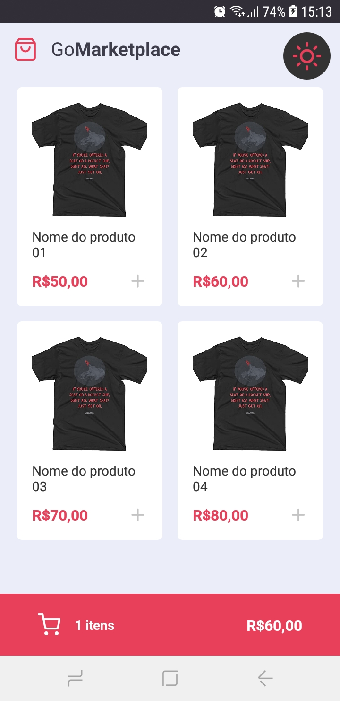
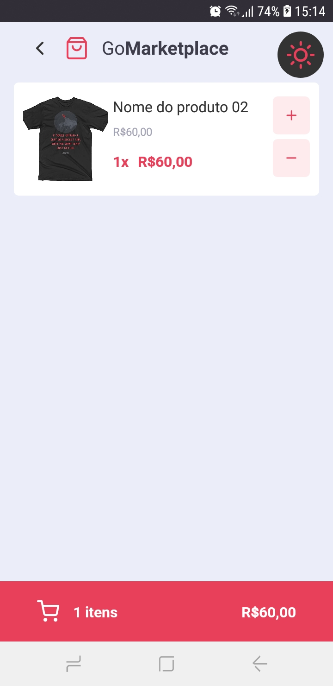
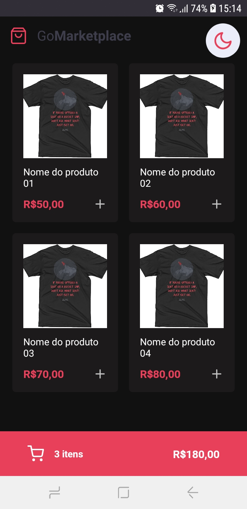
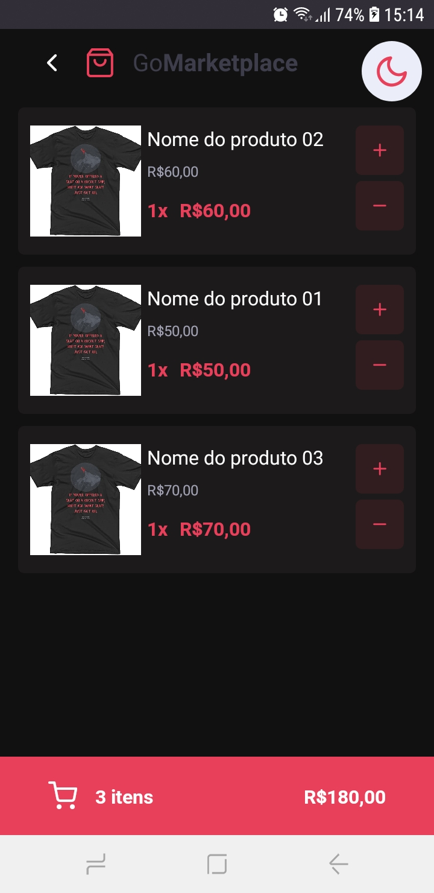

# 🚀 GoMarketplace

## 🔖 Sobre

  GoMarketplace, uma aplicação de vendas, o usuário pode adicionar e remover produtos do carrinho.

<h1>Funcionalidades</h1>
<ul>
  <li>Listar os produtos.</li>
  <li>
    Adicionar e remover produtos do carrinho, caso o aplicativo seja fechado, os produtos ficam salvos no carrinho.
  </li>
</ul>

## 📷 Screenshot:

  💻 Adicionei um tema light/dark, quando o aplicativo é fechado, o tema usado antes de fechar fica salvo.

    
    
    
    
    

# 🚀 Tecnologias
<ul>
    <li>✔️ TypeScript</li>
    <li>✔️ React Native</li>
    <li>✔️ Context Api</li>
    <li>✔️ React Hooks</li>
    <li>✔️ Styled Components</li>
    <li>✔️ JSON Server</li>
</ul>

#

<h3 align="center"> Made with 💜 by <a href="https://www.linkedin.com/in/pedro-lucas-4b2941199/">Pedro Lucas</a></h3>
